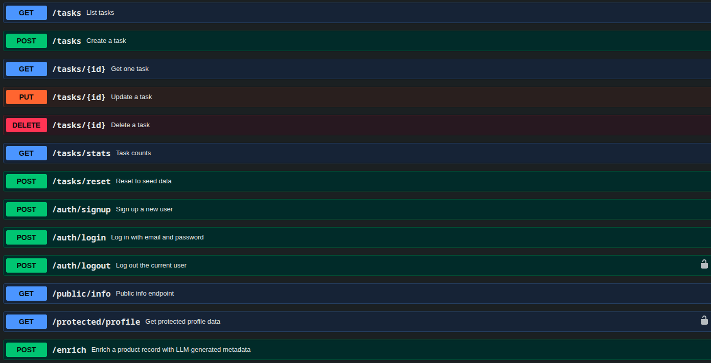

# flyrank Task API A17

RESTful API built using ExpressJS — tasks CRUD with Supabase Auth (signup/login/logout).

## Setup

1. Clone the repository

```bash
git clone https://github.com/faugconti/flyrank-BE.git
```

2. Move to A17 Folder

```bash
cd A17
```

3. Modify your .env

```bash
cp .env.example .env
```

4. Run the containers

```bash
docker-compose up -d
```

The server will run on:

```
http://localhost:3000
```

On first run, `tasks.db` is created automatically with the `tasks` table and three example tasks (if running with SQLite DB_PROVIDER env). 
The database file is git-ignored so each clone starts fresh.

## Environment variables

| Variable | Description |
|---------|----------|
| PORT | Server port (default: 3000)|
| DB_DRIVER | sqlite (default) or postgres |
| DATABASE_URL | Postgres connection string (e.g. postgres://postgres:dev@db:5432/tasks) |
| POSTGRES_DB | Database name for the Postgres container |
| POSTGRES_PASSWORD | Password for the Postgres container |
| SUPABASE_URL | Your Supabase project URL |
| SUPABASE_KEY | Your Supabase anon/public key |
| LLM_BASE_URL | OpenAI-compatible endpoint of the provider (Gemini: `https://generativelanguage.googleapis.com/v1beta/openai/`) |
| LLM_API_KEY | Provider API key |
| LLM_MODEL | Model name (e.g. `gemini-2.5-flash`) |
| LLM_TIMEOUT_MS | LLM call timeout in ms (default 30000) |
| LLM_STUB | Set to `1` to skip the model and return a stub response |
| LLM_ENABLED | Set to `false` to disable the LLM feature entirely (kill switch) |


## Docs




## Endpoints

| Method | Endpoint | Auth | Description |
|---|---|---|---|
| GET | / | No | API information |
| GET | /health | No | Health check |
| GET | /docs | No | Swagger UI |
| GET | /public/info | No | Public welcome message |
| POST | /auth/signup | No | Create a new user |
| POST | /auth/login | No | Log in, receive tokens |
| POST | /auth/logout | Yes | Log out current session |
| GET | /protected/profile | Yes | Get user profile (token verified) |
| GET | /tasks | No | List all tasks |
| GET | /tasks/stats | No | Task statistics |
| GET | /tasks/{id} | No | Get a task by id |
| POST | /tasks | No | Create a task |
| POST | /tasks/reset | No | Reset to seed data |
| PUT | /tasks/{id} | No | Update a task |
| DELETE | /tasks/{id} | No | Delete a task |
| POST | /enrich | No | Enrich a product record with LLM (category, summary, quality flags) |

## LLM enrichment endpoint

`POST /enrich` takes a scraped record (`title` required, `description` optional)
and returns an LLM-generated category, one-sentence summary and data-quality
flags. Set `LLM_STUB=1` in `.env` to run without calling the model.

Valid request:

```bash
LLM_STUB=1 node index.js &
curl -s -X POST http://localhost:3000/enrich \
  -H "Content-Type: application/json" \
  -d '{"title":"A Light in the Attic","description":"A classic collection of poetry by Shel Silverstein."}'
```

Output:

```json
{"category":"fiction","summary":"Stub enrichment for \"A Light in the Attic\".","quality_flags":[],"confidence":1}
```

Broken request (missing title → 400 naming the field):

```bash
curl -i -X POST http://localhost:3000/enrich \
  -H "Content-Type: application/json" \
  -d '{"description":"no title here"}'
```

Output:

```http
HTTP/1.1 400 Bad Request

{"error":"title: Invalid input: expected string, received undefined"}
```

## Example SQL query

```sql
SELECT * FROM tasks WHERE done = 0;
```

Returns all open (unfinished) tasks.

## Example

```bash
curl -i -X POST http://localhost:3000/tasks \
-H "Content-Type: application/json" \
-d "{\"title\":\"Buy groceries\"}"
```

Output:

```http
HTTP/1.1 201 Created
Content-Type: application/json

{
  "id": 4,
  "title": "Buy groceries",
  "done": false
}
```
