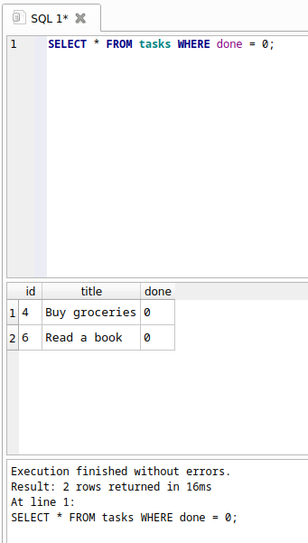
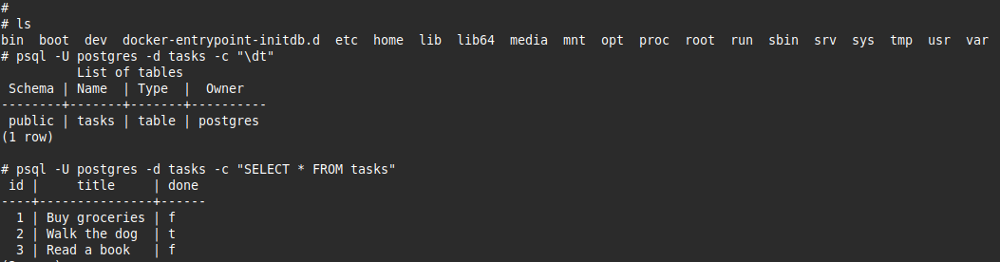

# flyrank-BE-04

## Why SQLite

Single file (`tasks.db`), zero setup, survives restarts. The database is created automatically on first run with the schema and three seeded tasks.

## Setup

1. Clone the repository

```bash
git clone https://github.com/faugconti/flyrank-BE.git
```

2. Move to BE-04 Folder

```bash
cd BE-04
```

3. Modify your .env

```bash
cp .env.example .env
```

4. Run the containers

```bash
docker-compose up -d
```

The server will run on:

```
http://localhost:3000
```

On first run, `tasks.db` is created automatically with the `tasks` table and three example tasks (if running with SQLite DB_PROVIDER env). 
The database file is git-ignored so each clone starts fresh.

## Environment variables

| Variable | Description |
|---------|----------|
| PORT | Server port (default: 3000)|
| DB_DRIVER | sqlite (default) or postgres |
| DATABASE_URL | Postgres connection string (e.g. postgres://postgres:dev@db:5432/tasks) |
| POSTGRES_DB | Database name for the Postgres container |
| POSTGRES_PASSWORD | Password for the Postgres container |
| SUPABASE_URL | Your Supabase project URL |
| SUPABASE_KEY | Your Supabase anon/public key |


## SQLite Database




## Postgre Database



## Endpoints

| Method | Endpoint | Description |
|---------|----------|-------------|
| GET | / | API information |
| GET | /health | Health check |
| GET | /docs | swagger documentation |
| GET | /tasks | List all tasks |
| GET | /tasks/{id} | Get a task by id |
| POST | /tasks | Create a task |
| PUT | /tasks/{id} | Update a task |
| DELETE | /tasks/{id} | Delete a task |
| POST | /auth/signup | Create a new user |
| POST | /auth/login | login with your user |

## Example SQL query

```sql
SELECT * FROM tasks WHERE done = 0;
```

Returns all open (unfinished) tasks.

## Example

```bash
curl -i -X POST http://localhost:3000/tasks \
-H "Content-Type: application/json" \
-d "{\"title\":\"Buy groceries\"}"
```

Output:

```http
HTTP/1.1 201 Created
Content-Type: application/json

{
  "id": 4,
  "title": "Buy groceries",
  "done": false
}
```
