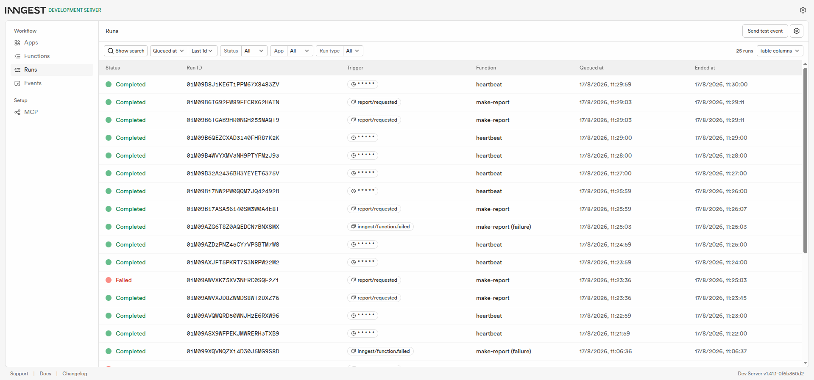

# Your First Background Job

A small API whose slow work runs in a **background job** instead of inside the request. `POST /reports` answers in milliseconds, the ~8-second report is built by an Inngest background job, a status endpoint reports progress, and a **cron job** logs a summary every minute — no request involved.

## How to run it

Two terminals, both must stay open:

```bash
npm install

npm start

npx inngest-cli@latest dev -u http://localhost:3000/api/inngest
```

Then open the dashboard at `http://localhost:8288`. (The API keeps its reports in memory — restarting it clears them)

## Endpoints

| Method | Path | What it does |
|---|---|---|
| `GET` | `/health` | `200 {"status":"ok"}` |
| `POST` | `/reports` | Body `{"topic":"cats"}` → **202** `{id, status:"pending"}` instantly, fires the `report/requested` event. Missing `topic` → **400**, no event sent. |
| `GET` | `/reports/:id` | `pending` first, `done` + `result` ~8s later, `failed` if the job gave up. Unknown id → **404** |
| `POST` | `/api/inngest` | Inngest endpoint (the Dev Server talks to this — not for humans) |

## The three functions

| Function | Trigger | What it does |
|---|---|---|
| `say-hello` | event `test/hello` | Sleeps 5s (`step.sleep`), returns `"Hello from the background!"` — the Stage 1 intro |
| `make-report` | event `report/requested` | Two steps: `do-the-slow-work` (sleep 8s) then `build-report` (saves the result). `retries: 2` (3 attempts). Topic `"fail"` throws `"The report oven is broken!"` so you can watch it retry and fail. An implicit `onFailure` handler (visible as `make-report (failure)`) marks the report `failed`. |
| `heartbeat` | cron `* * * * *` | Every minute, logs a summary line: `[heartbeat] X pending, Y done, Z failed` |

## Proof

```text
$ curl -i -X POST http://localhost:3000/reports -H "Content-Type: application/json" -d '{"topic":"cats"}'
HTTP/1.1 202 Accepted
Content-Type: application/json; charset=utf-8

{"id":"92bb12be-cee0-4235-a7b8-66d01ad9519a","status":"pending"}        (28 ms)

$ curl http://localhost:3000/reports/92bb12be-cee0-4235-a7b8-66d01ad9519a
{"id":"92bb12be-cee0-4235-a7b8-66d01ad9519a","topic":"cats","status":"pending"}

$ curl http://localhost:3000/reports/92bb12be-cee0-4235-a7b8-66d01ad9519a
{"id":"92bb12be-cee0-4235-a7b8-66d01ad9519a","topic":"cats","status":"done","result":"Report for cats: done after 8 seconds of hard work!"}
```

The request answers in **milliseconds** even though the work takes **8 seconds** — the 202 pattern behind every "we'll email you when it's ready".



## Homework sentences

**Stage 3 — retry vs. validation:** Bad input (a missing `topic`) is rejected at the door with 400 because re-running it would fail forever, whereas a job failure gets retried because the failure might be temporary.

**Stage 4 — cron expressions:** `0 8 * * *` runs every day at 08:00, and `0 22 * * 0` runs every Sunday at 22:00 (both verified on crontab.guru.

## Project structure

```
src/
├── index.js                  # bootstrap: express, routes, port 3000
├── routes/                   # URL mapping
│   ├── health.routes.js
│   ├── reports.routes.js
│   └── inngest.routes.js     # serves the job functions at /api/inngest
├── controllers/              # HTTP concerns (status codes, JSON)
│   ├── health.controller.js
│   └── reports.controller.js
├── services/                 # business logic
│   ├── health.service.js
│   └── reports.service.js    # in-memory map, shared by API and jobs
└── jobs/                     # Inngest client + the event/cron functions
    ├── inngest.js
    ├── say-hello.job.js
    ├── make-report.job.js
    └── heartbeat.job.js
```