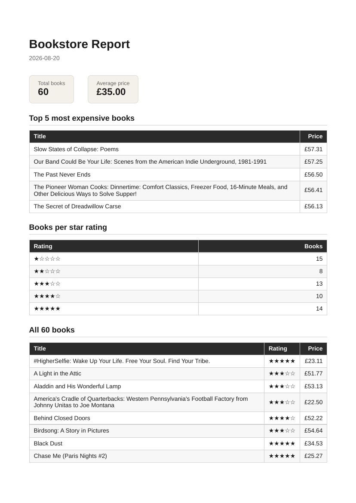

# BE-08 — PDF report generator

A report pipeline: query a SQLite database with SQL, render the numbers into a PDF with Playwright, and hand the file out by link.

**Dataset:** Option B — the bookstore. 60 book records from the A9 scraper (`data/books.json`).

## Run

```bash
npm install
npx playwright install chromium
npm run seed        # wipes and re-seeds report.db with 60 books
npm start           # server on http://localhost:3000
```

Seed is safe to run twice: it deletes all rows first, so you always end up with exactly one clean copy.

## API

- `GET /health` — health check
- `POST /reports` — generates a report, returns `201 { id, file }` after a few seconds
- `POST /reports` with `{ "force": true }` — skips the once-per-day check and generates a fresh report
- `GET /reports/:id` — report record with its file link; unknown id → `404`
- `GET /reports/:id/file` — downloads the PDF from disk

## Aggregation SQL

One set of queries turns 60 rows into the report (`src/repository/books.repository.js`):

```sql
-- total books
SELECT COUNT(*) AS n FROM books;

-- average price
SELECT AVG(price) AS avg FROM books;

-- top 5 most expensive
SELECT title, price FROM books ORDER BY price DESC LIMIT 5;

-- books per star rating
SELECT rating, COUNT(*) AS n FROM books GROUP BY rating ORDER BY rating;
```

## Proof: POST → download

```bash
$ npm run seed
Seeded 60 books into report.db

# first POST: a report already exists today → idempotent 200, same id
$ curl -i -X POST http://localhost:3000/reports
HTTP/1.1 200 OK
{"id":2,"file":"/reports/2/file"}

# force: true → a fresh report, 201
$ curl -i -X POST http://localhost:3000/reports -H 'Content-Type: application/json' -d '{"force":true}'
HTTP/1.1 201 Created
{"id":5,"file":"/reports/5/file"}

# GET the record
$ curl http://localhost:3000/reports/5
{"id":5,"created_at":"2026-08-20T15:05:01.625Z","file":"/reports/5/file"}

$ curl -i http://localhost:3000/reports/999   # unknown id
HTTP/1.1 404 Not Found

# download the file by link
$ curl -o my-report.pdf http://localhost:3000/reports/5/file
$ file my-report.pdf
my-report.pdf: PDF document, version 1.4, 3 pages (A4)
```

The PDF is served from disk (`res.sendFile`) — JSON responses only ever carry the file's link, never its bytes.

## Page 1 of a generated report (style is AI generated)



## Stage 4 note

I would move report generation out of the request the moment multiple users generate reports in parallel or reports grow large, because a request that blocks for seconds keeps the user hostage and makes the API fragile at scale.

## Stage 5 note

`POST /reports` only generates once per day: the check protects against the double-click — the same button, pressed twice, must not create two reports or charge twice. Without it, a user who double-orders an email or a payment gets charged twice, like the workshop's "never email a customer twice" rule — and the refunds and support tickets it provokes cost real money.